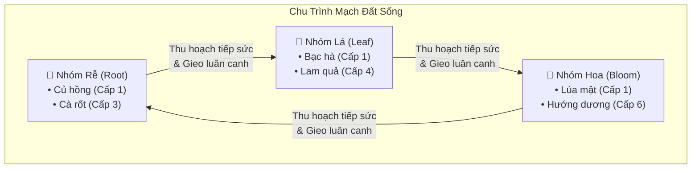
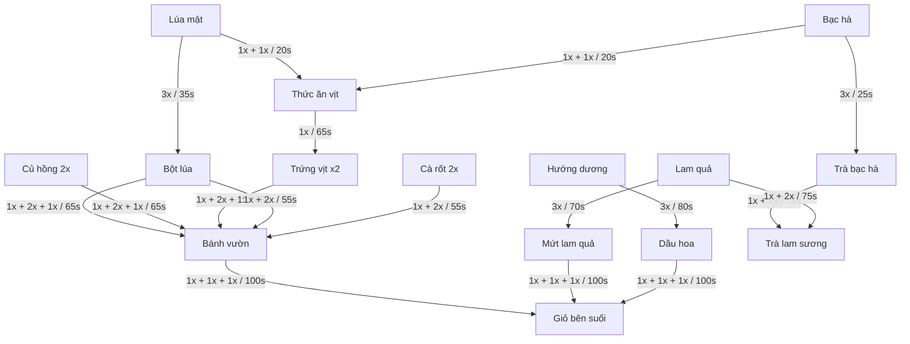
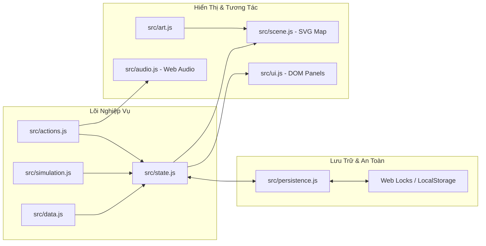

# 📜 Tài Liệu Thiết Kế Trò Chơi (GDD) — Mạch Vườn

> **Tên dự án:** Mạch Vườn (Living Soil Farming)  
> **Trải nghiệm trực tuyến:** [https://trantien2k5.github.io/game](https://trantien2k5.github.io/game)  
> **Thể loại:** Trò chơi mô phỏng nông trại chơi đơn (Single-player Farm Simulation)  
> **Nền tảng:** Trình duyệt Web (Desktop, Tablet, Mobile) — Thuần Vanilla JS, SVG & CSS  
> **Ngôn ngữ:** Tiếng Việt (Toàn bộ giao diện, cốt truyện và nội dung)

---

## 📑 Mục Lục

- [1. Triết Lý & Tổng Quan Thiết Kế](#1-triết-lý--tổng-quan-thiết-kế)
- [2. Cơ Chế Cốt Lõi: Mạch Đất Sống (Living Soil Circuits)](#2-cơ-chế-cốt-lõi-mạch-đất-sống-living-soil-circuits)
  - [2.1. Chu Trình 3 Nhóm Cây Trồng](#21-chu-trình-3-nhóm-cây-trồng)
  - [2.2. Quy Tắc Truyền Nhịp Sống (Pulse Delivery)](#22-quy-tắc-truyền-nhịp-sống-pulse-delivery)
  - [2.3. Quy Tắc Luân Canh Đất (Crop Rotation)](#23-quy-tắc-luân-canh-đất-crop-rotation)
- [3. Hệ Thống Kinh Tế & Nội Dung Trò Chơi](#3-hệ-thống-kinh-tế--nội-dung-trò-chơi)
  - [3.1. Bảng Thông Số Cây Trồng](#31-bảng-thông-số-cây-trồng)
  - [3.2. Chuỗi Chế Biến & Công Thức Sản Xuất](#32-chuỗi-chế-biến--công-thức-sản-xuất)
  - [3.3. Các Vùng Đất Mở Rộng](#33-các-vùng-đất-mở-rộng)
  - [3.4. Hệ Thống Nâng Cấp Nông Trại](#34-hệ-thống-nâng-cấp-nông-trại)
  - [3.5. Chu Kỳ Thời Tiết & Biến Động Thị Trường](#35-chu-kỳ-thời-tiết--biến-động-thị-trường)
  - [3.6. Tiến Trình 8 Cấp Độ & Sổ Vườn Chính Tuyến](#36-tiến-trình-8-cấp-độ--sổ-vườn-chính-tuyến)
- [4. Cơ Chế Chống Bế Tắc & Mô Hình Thời Gian](#4-cơ-chế-chống-bế-tắc--mô-hình-thời-gian)
  - [4.1. Cam Kết Chống Bế Tắc (Anti-lock Guarantees)](#41-cam-kết-chống-bế-tắc-anti-lock-guarantees)
  - [4.2. Mô Hình Thời Gian & Tiến Trình Ngoại Tuyến](#42-mô-hình-thời-gian--tiến-trình-ngoại-tuyến)
- [5. Kiến Trúc Kỹ Thuật & Giả Định Thiết Kế](#5-kiến-trúc-kỹ-thuật--giả-định-thiết-kế)

---

## 1. Triết Lý & Tổng Quan Thiết Kế

**Mạch Vườn** được xây dựng xung quanh trải nghiệm thư thái nhưng giàu tính chiến thuật không gian. Thay vì gieo trồng thụ động chờ thời gian trôi qua, người chơi tương tác với một **mạng lưới đất sống có kết nối hình học**, nơi vị trí gieo hạt, thứ tự thu hoạch và thời điểm luân canh tạo thành một cỗ máy sinh học tuần hoàn hiệu quả.

### Trọng Tâm Thiết Kế

1. **Trực quan & Tức thì:** Cây củ đầu tiên đã chín sẵn khi vừa vào game; luật chơi đơn giản, dễ nắm bắt nhưng có chiều sâu tối ưu.
2. **Không áp lực tiêu cực:** Cây trồng không bao giờ héo úa hay chết; nông sản không bị thối rữa; đơn hàng hẹn giờ không phạt khi hết hạn.
3. **Mỹ thuật nguyên bản:** 100% đồ họa là Vector SVG độc bản được lập trình tỉ mỉ, không dùng tài nguyên vay mượn từ các game khác.
4. **Trọn vẹn & Độc lập:** Hoạt động hoàn toàn phía Client (trình duyệt), không phụ thuộc máy chủ backend, không nạp thẻ, không gacha hay quảng cáo.

---

## 2. Cơ Chế Cốt Lõi: Mạch Đất Sống (Living Soil Circuits)

### 2.1. Chu Trình 3 Nhóm Cây Trồng

Mọi loại cây trong game thuộc về một trong ba họ sinh thái tạo thành vòng tròn khép kín:
$$\text{Rễ (Root)} \longrightarrow \text{Lá (Leaf)} \longrightarrow \text{Hoa (Bloom)} \longrightarrow \text{Rễ (Root)}$$

- **Nhóm Rễ (Root):** Cây thu hồi vốn nhanh, làm nguyên liệu cho bánh củ và đơn hàng đầu kỳ.
- **Nhóm Lá (Leaf):** Cây cung cấp thức ăn chăn nuôi cho nhà vịt và ủ các loại trà thanh nhiệt.
- **Nhóm Hoa (Bloom):** Cây chu kỳ dài, phục vụ xay bột, chưng cất dầu hoa và giỏ quà cao cấp.

### 2.2. Quy Tắc Truyền Nhịp Sống (Pulse Delivery)

Khi thu hoạch một cây trồng đã chín:

1. Trò chơi kiểm tra **4 ô đất tiếp giáp trực giao** (trên, dưới, trái, phải).
2. Nếu tại ô kế bên có một cây **đang trong quá trình lớn** (chưa chín) thuộc **nhóm kế tiếp** trong chu trình:
   - Cây nhận xung sẽ được **giảm ngay 20%** tổng thời gian sinh trưởng gốc.
   - Cây nhận xung được cộng thêm **+1 sản lượng** khi thu hoạch.
   - Mỗi lần trồng, một cây nhận tối đa **2 nhịp sống** ($+2$ sản lượng, giảm $40\%$ thời gian).
3. **Tính chất xung:** Xung truyền lập tức, **không đệ quy** (không kích hoạt chuỗi thu hoạch domino ngoài ý muốn).

### 2.3. Quy Tắc Luân Canh Đất (Crop Rotation)

- Nếu người chơi gieo một hạt giống thuộc nhóm kế tiếp ngay trên ô đất vừa thu hoạch nhóm trước đó (ví dụ: gieo _Bạc hà (Lá)_ lên ô vừa nhổ _Củ hồng (Rễ)_), cây mới sẽ nhận ngay danh hiệu **Luân Canh**.
- Hiệu ứng: Được cộng thêm **+1 sản lượng** khi thu hoạch.

---

## 3. Hệ Thống Kinh Tế & Nội Dung Trò Chơi

### 3.1. Bảng Thông Số Cây Trồng

| Cây Trồng       | Họ  | Cấp Mở | Giá Hạt  | Thời Gian Gốc | Sản Lượng Gốc | Giá Bán Chợ | XP Thu Hoạch | Ghi Chú Đặc Trưng               |
| :-------------- | :-: | :----: | :------: | :-----------: | :-----------: | :---------: | :----------: | :------------------------------ |
| **Củ hồng**     | Rễ  |   1    | **0 xu** |      24s      |       2       |    3 xu     |     3 XP     | Miễn phí, thu hồi vốn nhanh     |
| **Bạc hà**      | Lá  |   1    |   3 xu   |      40s      |       3       |    4 xu     |     5 XP     | Ủ trà, trộn cám vịt             |
| **Lúa mật**     | Hoa |   1    |   5 xu   |      60s      |       3       |    6 xu     |     7 XP     | Xay bột lúa, nuôi vịt           |
| **Cà rốt**      | Rễ  |   3    |   8 xu   |      85s      |       4       |    7 xu     |    10 XP     | Sản lượng cao, làm bánh rau củ  |
| **Lam quả**     | Lá  |   4    |  12 xu   |     110s      |       3       |    13 xu    |    13 XP     | Giá trị cao, nấu mứt & trà lam  |
| **Hướng dương** | Hoa |   6    |  16 xu   |     150s      |       4       |    12 xu    |    17 XP     | Ép dầu hoa, gói giỏ quà cao cấp |

> [!TIP]
> Tưới nước thủ công rút ngắn **25%** thời gian sinh trưởng gốc của cây (1 lần/vụ). Khi kết hợp đủ 2 nhịp sống ($-40\%$) và tưới nước ($-25\%$), thời gian lớn thực tế giảm đến **65%**.

### 3.2. Chuỗi Chế Biến & Công Thức Sản Xuất

- **Quy tắc hàng đợi:** Khi thêm công thức vào hàng đợi sản xuất, nguyên liệu trong kho bị **khấu trừ ngay lập tức**.
- **Thành phẩm sau sản xuất:** Nằm an toàn tại khay đón của nhà xưởng, không chiếm chỗ trong kho cho tới khi người chơi bấm thu nhận.
- **Biểu đồ không chu trình (DAG):** Đồ thị chế biến là một cây định hướng không có chu trình khép kín, đảm bảo không có rủi ro tạo vòng lặp vô hạn.

### 3.3. Các Vùng Đất Mở Rộng

Khu vườn khởi đầu với **9 ô đất canh tác** (3x3). Người chơi có thể mở khóa thêm 3 vùng đất đặc biệt để đạt tổng cộng **25 ô đất**:

| Vùng Đất                | Cấp Yêu Cầu | Chi Phí  | Số Ô Đất | Lợi Thế Sinh Thái Đặc Biệt                                      |
| :---------------------- | :---------: | :------: | :------: | :-------------------------------------------------------------- |
| **Khởi đầu (Vườn nhà)** |    Cấp 1    |   0 xu   |   9 ô    | Đất cơ bản, có sẵn giếng nước và nhà xay gió                    |
| **Bờ suối (Creek)**     |    Cấp 3    |  260 xu  |   +5 ô   | Đất ven nước: Khi trời mưa tích thêm +2 đơn vị nước vào giếng   |
| **Bãi nắng (Sunny)**    |    Cấp 5    |  680 xu  |   +5 ô   | Vùng đón nắng: Cây thuộc nhóm Hoa lớn nhanh hơn 15%             |
| **Sườn đồi (Hill)**     |    Cấp 7    | 1,300 xu |   +6 ô   | Đất đồi dốc: Cây nhóm Rễ trồng luân canh được thêm +1 sản lượng |

### 3.4. Hệ Thống Nâng Cấp Nông Trại

| Hạng Mục               | Cấp Mở | Chi Phí Gốc | Số Cấp Tối Đa | Hiệu Quả Mỗi Cấp                                                       |
| :--------------------- | :----: | :---------: | :-----------: | :--------------------------------------------------------------------- |
| **Kho thoáng rộng**    | Cấp 2  |   120 xu    |     3 lần     | $+40$ sức chứa kho mỗi cấp (Hệ số chi phí: $\times 2.5$)               |
| **Bàn soạn mẻ**        | Cấp 3  |   180 xu    |     2 lần     | $+1$ vị trí hàng đợi cho tất cả các xưởng chế biến (Hệ số: $\times 3$) |
| **Rãnh tưới lan**      | Cấp 4  |   350 xu    |     1 lần     | Tưới 1 ô lan sang tất cả các ô kế cận có cây đang cần nước             |
| **Mái kính đón sương** | Cấp 8  |  1,800 xu   |     1 lần     | **Tưới nước không tốn điểm nước giếng**; tăng thêm $+60$ chỗ chứa kho  |

### 3.5. Chu Kỳ Thời Tiết & Biến Động Thị Trường

Cứ mỗi **4 phút (240 giây)**, thời tiết khu vườn và nhu cầu thị trường sẽ chuyển biến nhịp nhàng:

| Tiết Trời         | Biểu Tượng | Hiệu Ứng Sinh Thái                                                      | Mặt Hàng Chợ Ưu Tiên Mua Giá Cao |
| :---------------- | :--------: | :---------------------------------------------------------------------- | :------------------------------- |
| **Nắng dịu**      |     ☀️     | Cây nhóm **Hoa** sinh trưởng nhanh hơn **15%**                          | **Trà bạc hà** (Tea)             |
| **Mưa ghé vườn**  |     🌧️     | Cây nhóm **Lá** nhanh hơn **15%**; Tốc độ hồi nước giếng **$\times 2$** | **Bột lúa** (Flour)              |
| **Gió bên suối**  |     🍃     | Cây nhóm **Rễ** sinh trưởng nhanh hơn **15%**                           | **Trứng vịt** (Egg)              |
| **Chiều mật ong** |     🌅     | Không tăng tốc cây; Thương lái trả thêm tiền cho bánh & mứt             | **Bánh vườn** (Bread)            |

### 3.6. Tiến Trình 8 Cấp Độ & Sổ Vườn Chính Tuyến

#### Bảng Cấp Độ Người Chơi

- **Cấp 1 (0 XP) — Mầm đầu tiên:** Mở Củ hồng, Bạc hà, Lúa mật, Nhà xay gió.
- **Cấp 2 (65 XP) — Góc vườn nhỏ:** Mở Nhà vịt, Cám vịt, Trứng vịt, Nâng cấp kho.
- **Cấp 3 (180 XP) — Đất lành:** Mở Cà rốt, Bếp bên suối, Bánh vườn, Mở rộng Bờ suối.
- **Cấp 4 (600 XP) — Vườn đơm trái:** Mở Lam quả, Mứt quả, Rãnh tưới lan.
- **Cấp 5 (1,400 XP) — Những người bạn:** Mở Bãi nắng, Mở rộng hàng đợi chế biến.
- **Cấp 6 (2,800 XP) — Mùa hoa mới:** Mở Hướng dương, Xưởng ép hoa, Dầu hoa, Trà lam sương.
- **Cấp 7 (4,700 XP) — Nhịp vườn lớn:** Mở Sườn đồi, Giỏ quà bên suối.
- **Cấp 8 (7,500 XP) — Một miền xanh:** Mở Mái kính đón sương (Greenhouse), hoàn thiện nông trang.

#### 8 Chương Sổ Vườn (Journal Quests)

1. _Món quà từ đất:_ Thu hoạch 3 ô cây đầu tiên $\rightarrow$ Thưởng 35 xu, 15 XP.
2. _Một mạch nối dài:_ Truyền 3 nhịp sống sang cây kế cận $\rightarrow$ Thưởng 65 xu, 25 XP.
3. _Hương trà trong gió:_ Thu 3 mẻ thành phẩm từ các xưởng $\rightarrow$ Thưởng 80 xu, 35 XP.
4. _Lời hẹn đầu ngõ:_ Hoàn thành 5 đơn hàng cho bà con $\rightarrow$ Thưởng 110 xu, 45 XP.
5. _Những bước chân bé:_ Thu 3 mẻ trứng từ nhà vịt $\rightarrow$ Thưởng 140 xu, 55 XP.
6. _Vươn về phía nắng:_ Mở khóa 2 vùng đất mới $\rightarrow$ Thưởng 200 xu, 75 XP.
7. _Vườn có nhịp riêng:_ Tạo tổng cộng 80 nhịp sống $\rightarrow$ Thưởng 300 xu, 100 XP.
8. _Một miền xanh:_ Xây dựng thành công Mái kính đón sương $\rightarrow$ Thưởng 500 xu, 150 XP.

---

## 4. Cơ Chế Chống Bế Tắc & Mô Hình Thời Gian

### 4.1. Cam Kết Chống Bế Tắc (Anti-lock Guarantees)

Hệ sinh thái game được thiết kế toán học để người chơi **không bao giờ rơi vào trạng thái bế tắc (soft-lock/hard-lock)**:

- **0 xu vẫn phát triển được:** Hạt giống Củ hồng giá **0 xu**. Người chơi luôn có thể gieo trồng để thu hoạch và bán lấy tiền.
- **Không suy hao tài sản:** Cây trồng đã chín để bao lâu cũng không hỏng; giếng cạn tự hồi phục theo thời gian.
- **Kho đầy an toàn:** Khi kho đầy, nông sản chín và thành phẩm vẫn nằm nguyên tại ruộng/xưởng mà không bị mất. Người chơi luôn có thể mở tab Chợ để bán bớt đồ giải phóng kho.
- **Phần thưởng Quest không chiếm kho:** Tiền và XP từ nhiệm vụ được cộng trực tiếp vào ví/thanh cấp độ mà không đòi hỏi khoảng trống trong kho.

### 4.2. Mô Hình Thời Gian & Tiến Trình Ngoại Tuyến

- **Đồng hồ mô phỏng đơn điệu (Monotonic Simulation Clock):** Game sử dụng timestamp tuyệt đối để tính toán thời điểm hoàn thành của cây trồng và xưởng sản xuất.
- **Giới hạn ngoại tuyến an toàn:** Khi tắt game hoặc rời tab, hệ thống tính toán thời gian trôi qua tối đa **8 giờ (MAX_OFFLINE = 28,800,000 ms)**.
- **Không tự động hóa vô hạn:** Game ngoại tuyến chỉ hoàn thành các cây/mẻ chế biến **đã được gieo/xếp hàng từ trước**. Game **không tự động gieo trồng hay tự bán hàng** khi vắng mặt, tránh phá vỡ giá trị trải nghiệm tương tác.

---

## 5. Kiến Trúc Kỹ Thuật & Giả Định Thiết Kế

### Các Quyết Định Kỹ Thuật Chính

1. **Module hóa hướng chức năng:** Tách bạch tuyệt đối giữa dữ liệu thuần (`data.js`), trạng thái tuần tự hóa (`state.js`), luật giao dịch (`actions.js`), đồ họa SVG (`art.js`/`scene.js`) và giao diện tương tác (`ui.js`).
2. **Khung nhìn cố định 100dvh:** Giao diện bám chặt khung màn hình không cuộn dọc trình duyệt; các danh sách dài cuộn nội bộ bằng CSS.
3. **SVG Camera Pan/Zoom:** Người chơi có thể di chuyển và thu phóng bản đồ trực tiếp bằng chuột hoặc cử chỉ cảm ứng trên thiết bị di động.
4. **Web Audio Synthesis:** Toàn bộ hiệu ứng âm thanh (tiếng cuốc đất, tiếng nước tưới, tiếng chuông thu hoạch, tiếng hoàn thành đơn) được tổng hợp bằng dao động sóng Web Audio, không cần tải bất kỳ tệp `.mp3` hay `.wav` nào.
