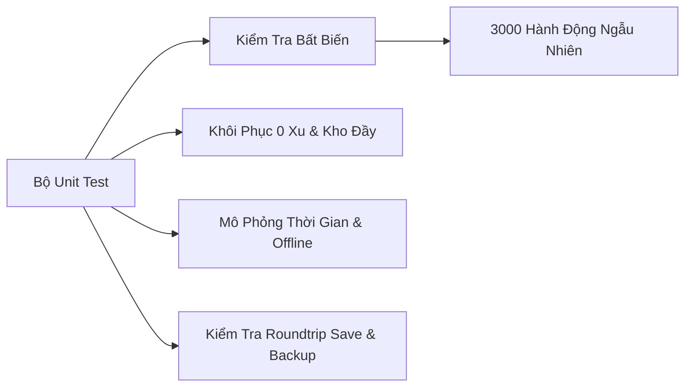

# 🔬 Báo Cáo Kiểm Định Chất Lượng (QA & Verification) — Mạch Vườn

> **Tài liệu kiểm định & Báo cáo chất lượng toàn diện**  
> **Dự án:** Mạch Vườn (Living Soil Farming)  
> **Trải nghiệm thực tế:** [https://trantien2k5.github.io/game](https://trantien2k5.github.io/game)  
> **Mục tiêu:** Xác minh độ ổn định logic, tính toàn vẹn dữ liệu lưu trữ, độ cân bằng kinh tế và độ tương thích giao diện đa thiết bị.

---

## 📑 Mục Lục

- [1. Đánh Giá Thiết Kế Trò Chơi (Game Design Review)](#1-đánh-giá-thiết-kế-trò-chơi-game-design-review)
- [2. Đánh Giá Kỹ Thuật & Các Lỗi Đã Khắc Phục](#2-đánh-giá-kỹ-thuật--các-lỗi-đã-khắc-phục)
- [3. Hệ Thống Kiểm Thử Tự Động (Automated Test Suites)](#3-hệ-thống-kiểm-thử-tự-động-automated-test-suites)
  - [3.1. Unit Test & Kiểm Tra Bất Biến (Invariant Coverage)](#31-unit-test--kiểm-tra-bất-biến-invariant-coverage)
  - [3.2. Kiểm Thử Trình Duyệt Thực Tế (Browser E2E Tests)](#32-kiểm-thử-trình-duyệt-thực-tế-browser-e2e-tests)
  - [3.3. Kiểm Tra Bố Cục Đa Khung Nhìn (Layout & Viewport Matrix)](#33-kiểm-tra-bố-cục-đa-khung-nhìn-layout--viewport-matrix)
- [4. Đánh Giá Cân Bằng Kinh Tế (Economy Simulation)](#4-đánh-giá-cân-bằng-kinh-tế-economy-simulation)
- [5. Ma Trận Thiết Bị & Độ Phân Giải Đã Kiểm Tra](#5-ma-trận-thiết-bị--độ-phân-giải-đã-kiểm-tra)
- [6. Giới Hạn Kiểm Định & Định Hướng Mở Rộng](#6-giới-hạn-kiểm-định--định-hướng-mở-rộng)

---

## 1. Đánh Giá Thiết Kế Trò Chơi (Game Design Review)

- **Độ sâu chiến thuật không gian:** Vòng lặp `Rễ ➔ Lá ➔ Hoa ➔ Rễ` tạo ra sự kết hợp chặt chẽ giữa vị trí gieo trồng và thời điểm thu hoạch. Xung nhịp bị chặn ở mức tối đa 2 nhịp/vụ và không kích hoạt dây chuyền đệ quy, giữ cho game luôn nằm trong tầm kiểm soát chiến thuật của người chơi.
- **Tiến trình chơi (Pacing):**
  - Trong phiên bản thử nghiệm ban đầu, người chơi đạt cấp tối đa quá sớm (trước phút thứ 20).
  - Sau khi tinh chỉnh đường cong kinh nghiệm (XP curve): Với bot mô phỏng 60 phút tiêu chuẩn, người chơi đạt **Cấp 5 ở phút thứ 10**, mở toàn bộ đất ở **phút thứ 20**, và hoàn thành Mái kính đón sương sau **phút thứ 30**.
- **Tính trọn vẹn của chiến dịch:** Chiến dịch 8 chương có đích đến rõ ràng. Sau khi hoàn thành Sổ vườn và mở toàn bộ nông trại, người chơi tiếp tục giao thương và tối ưu hóa sản lượng vô hạn mà không bị áp lực thành tích.

---

## 2. Đánh Giá Kỹ Thuật & Các Lỗi Đã Khắc Phục

| Vấn Đề Ghi Nhận                      | Phân Tích & Nguyên Nhân                                                                                                             | Giải Pháp Đã Áp Dụng                                                                                                           | Trạng Thái |
| :----------------------------------- | :---------------------------------------------------------------------------------------------------------------------------------- | :----------------------------------------------------------------------------------------------------------------------------- | :--------: |
| **Lỗi tràn số PRNG State**           | Trình kiểm tra bản lưu (save validator) áp giới hạn 1 tỷ cho bộ sinh số ngẫu nhiên 32-bit, dẫn tới việc từ chối các bản lưu hợp lệ. | Cập nhật bộ kiểm tra để chấp nhận toàn bộ dải giá trị số nguyên `uint32` ($0 \rightarrow 2^{32}-1$).                           | ✅ Đã sửa  |
| **Lệch đồng hồ hệ thống**            | Khi đồng hồ máy tính bị chỉnh lùi về quá khứ, simulation timestamp bị giật lùi gây xung đột tiến độ.                                | Tự động neo lại điểm mốc wall-time mà không làm lùi bước tiến trình mô phỏng nội bộ.                                           | ✅ Đã sửa  |
| **Ngoại lệ LocalStorage**            | Một số trình duyệt (chế độ ẩn danh, bảo mật cao) ném exception ngay khi truy cập getter `window.localStorage`.                      | Đưa toàn bộ thao tác truy cập LocalStorage vào khối xử lý ngoại lệ an toàn (try/catch boundary).                               | ✅ Đã sửa  |
| **Xung đột đa tab (Race Condition)** | Mở cùng lúc 2 tab có thể ghi đè làm mất tiến độ của nhau.                                                                           | Tích hợp **Web Locks API** để bảo đảm chỉ 1 tab được cấp quyền ghi dữ liệu; fallback sang `storage-event` trên trình duyệt cũ. | ✅ Đã sửa  |
| **Hiển thị dấu tiếng Việt**          | Font chữ hiển thị tiêu đề ban đầu bị lỗi khoảng cách với các nguyên âm có nhiều dấu tiếng Việt (như ể, ễ, ộ).                       | Chuyển font tiêu đề sang font chuẩn `Cambria` hỗ trợ đầy đủ glyphs tiếng Việt sắc nét.                                         | ✅ Đã sửa  |
| **Bố cục màn hình di động nhỏ**      | Thanh chọn hạt giống bị che khuất trên màn hình điện thoại ngang và laptop màn hình thấp.                                           | Tái cấu trúc thành bảng hạt giống 2 cột bên hông ruộng; giảm chiều cao map để luôn thấy trọn vẹn khu vực thao tác.             | ✅ Đã sửa  |

---

## 3. Hệ Thống Kiểm Thử Tự Động (Automated Test Suites)

### 3.1. Unit Test & Kiểm Tra Bất Biến (Invariant Coverage)

Tệp kiểm thử: `tests/game.test.js` (Chạy bằng `npm test`)

- **Chu trình sản xuất khép kín:** Kiểm tra tuần tự gieo hạt $\rightarrow$ lớn $\rightarrow$ tưới $\rightarrow$ thu hoạch $\rightarrow$ xếp hàng chế biến $\rightarrow$ nhận thành phẩm $\rightarrow$ giao dịch chợ.
- **Tính toán mạng lưới:** Kiểm tra 4 hướng lân cận, luân canh tại chỗ, thưởng vùng Sườn đồi, giới hạn 2 nhịp sống và lan truyền tưới nước.
- **Bảo vệ chống kẹt (Edge Cases):**
  - Khôi phục khi ví về 0 xu (bằng hạt Củ hồng miễn phí).
  - Xử lý khi kho đầy (không mất sản phẩm, chặn giao dịch không hợp lệ).
  - Từ chối giao dịch số âm, số thập phân hoặc không đủ nguyên liệu.
- **Mô phỏng thời gian:** Kiểm tra tính tương đương giữa nhiều bước nhảy thời gian nhỏ và một bước nhảy thời gian lớn (Large vs Small time steps).
- **Kiểm tra độ bền (Stress Test):** Thực hiện **3.000 hành động ngẫu nhiên có tính tất định (Deterministic Random Actions)** kèm kiểm tra tính hợp lệ của bản lưu sau mỗi chu kỳ.

### 3.2. Kiểm Thử Trình Duyệt Thực Tế (Browser E2E Tests)

Tệp kiểm thử: `tests/browser.js` (Chạy bằng `npm run test:browser`)

- Sử dụng Playwright điều khiển trình duyệt **Google Chrome thật**:
  - Thao tác chuột, chạm cảm ứng (touch) và phím tắt bàn phím.
  - Đóng mở các bảng chức năng (Sổ vườn, Xưởng, Chợ, Cài đặt).
  - Bật/tắt âm thanh Web Audio không gây lỗi luồng âm thanh.
  - Tải lại trang (F5), mở 2 tab đồng thời kiểm tra Web Locks.
  - Nâng cấp kho, mua đất mở rộng, xây dựng Mái kính đón sương.
  - Xuất file JSON, nhập file JSON, đặt lại tiến độ và phục hồi khi tệp lưu bị hỏng.

### 3.3. Kiểm Tra Bố Cục Đa Khung Nhìn (Layout & Viewport Matrix)

Tệp kiểm thử: `tests/layout.js` (Chạy bằng `npm run test:layout`)

- Đo kiểm tự động trên **13 kích thước màn hình** tiêu chuẩn.
- Đảm bảo **100dvh**, tuyệt đối không phát sinh thanh cuộn ngang trang (`scrollWidth === clientWidth`).
- Kiểm tra tính năng kéo/thu phóng camera bản đồ (SVG Pan/Zoom) độc lập với các thao tác click vào ô đất.
- Kiểm tra xoay màn hình (orientation change) không làm mất tab đang mở hoặc trạng thái nông trại.

---

## 4. Đánh Giá Cân Bằng Kinh Tế (Economy Simulation)

Tệp kiểm tra: `scripts/balance.js` (Chạy bằng `npm run balance`)

- **Biên lợi nhuận đất:** Biên lợi nhuận cơ bản của các loại cây dao động từ **12.8 đến 15.0 xu / ô đất / phút**.
- **Cây ngắn hạn vs Dài hạn:** Cây ngắn hạn (Củ hồng) có tốc độ quay vòng vốn nhanh nhất, trong khi cây dài hạn (Hướng dương, Lam quả) giảm tần suất thao tác, cho sản lượng lớn và mở khóa các chuỗi công thức cao cấp.
- **Biểu đồ chế biến không vòng lặp (Acyclic DAG):** Đảm bảo nguyên liệu tiêu hao ngay lập tức khi vào hàng đợi, thành phẩm chỉ cấp phát khi nhận hàng, và mỗi mã đơn hàng chỉ trả thưởng đúng 1 lần.
- **Hấp thụ tiền tệ (Coin Sinks):** Tiền kiếm được được tái đầu tư tự nhiên vào 4 công trình chế biến, 3 vùng đất mở rộng, nâng cấp sức chứa kho, mở thêm hàng đợi, rãnh tưới và nhà kính.

---

## 5. Ma Trận Thiết Bị & Độ Phân Giải Đã Kiểm Tra

| Thiết Bị Đại Diện               | Kích Thước (px) |   Tỷ Lệ / Chiều   |      Kết Quả Bố Cục      | Trạng Thái Cuộn Ngang |
| :------------------------------ | :-------------: | :---------------: | :----------------------: | :-------------------: |
| **iPhone SE / Phone Cỡ Nhỏ**    |    320 x 640    |  Dọc (Portrait)   |        ✅ Tối ưu         |  ❌ Không tràn (0px)  |
| **iPhone 14 / Mobile Hiện Đại** |    390 x 844    |  Dọc (Portrait)   |        ✅ Tối ưu         |  ❌ Không tràn (0px)  |
| **Android Phổ Thông**           |    360 x 800    |  Dọc (Portrait)   |        ✅ Tối ưu         |  ❌ Không tràn (0px)  |
| **Mobile Ngang Siêu Ngắn**      |    568 x 320    | Ngang (Landscape) | ✅ Bảng hạt giống 2 cột  |  ❌ Không tràn (0px)  |
| **Mobile Ngang Tiêu Chuẩn**     |    844 x 390    | Ngang (Landscape) | ✅ Bảng hạt giống 2 cột  |  ❌ Không tràn (0px)  |
| **iPad Mini / Tablet**          |   768 x 1024    |  Dọc (Portrait)   |        ✅ Tối ưu         |  ❌ Không tràn (0px)  |
| **iPad Air / Pro**              |   820 x 1180    |  Dọc (Portrait)   |        ✅ Tối ưu         |  ❌ Không tràn (0px)  |
| **Tablet Ngang**                |   1024 x 768    | Ngang (Landscape) |        ✅ Tối ưu         |  ❌ Không tràn (0px)  |
| **Laptop Tiêu Chuẩn**           |   1280 x 720    |       16:9        | ✅ Bảng bên phải cố định |  ❌ Không tràn (0px)  |
| **Laptop HD+ / Màn Phổ Biến**   |   1366 x 768    |       16:9        | ✅ Bảng bên phải cố định |  ❌ Không tràn (0px)  |
| **Desktop Full HD**             |   1920 x 1080   |       16:9        |   ✅ Tối ưu toàn cảnh    |  ❌ Không tràn (0px)  |

---

## 6. Giới Hạn Kiểm Định & Định Hướng Mở Rộng

> [!NOTE]
> Mặc dù hệ thống kiểm thử tự động đã bao phủ toàn diện các kịch bản logic và responsive, một số giới hạn thực tế cần lưu ý:

1. **Môi trường thiết bị vật lý:** Các bài kiểm tra trình duyệt chạy trên nền tảng Chromium desktop với chế độ giả lập màn hình cảm ứng; trải nghiệm trên phần cứng iOS Safari thực tế và chip xử lý di động tầm trung chưa được đo đạc qua thiết bị vật lý trực tiếp.
2. **Khảo nghiệm người dùng (Playtesting):** Cân bằng kinh tế hiện dựa trên mô hình bot toán học tất định 60 phút; cần bổ sung dữ liệu cảm nhận độ khó và mức độ gắn kết từ người chơi thực tế.
3. **Phạm vi lưu trữ:** Game hỗ trợ lưu trữ cục bộ trên từng trình duyệt và xuất/nhập tệp JSON thủ công. Game chưa tích hợp đồng bộ đám mây (Cloud Sync) hoặc tài khoản liên thiết bị.
4. **Vị trí công trình:** Các công trình và giếng nước được đặt tại vị trí cố định để đảm bảo bố cục trực quan; người chơi tự do sắp xếp cây trồng, đất canh tác và cờ trang trí.
