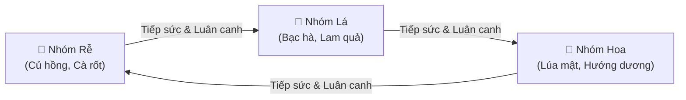

# 🌾 Mạch Vườn (Living Soil Farming)

[](https://trantien2k5.github.io/game)
[](https://nodejs.org/)
[](LICENSE)
[](<>)
[](<>)

> 🎮 **Trải nghiệm trực tiếp tại:** **[https://trantien2k5.github.io/game](https://trantien2k5.github.io/game)**
>
> **Mạch Vườn** là tựa game nông trại chơi đơn thuần Việt, chạy trực tiếp trên trình duyệt web. Toàn bộ hình ảnh trong game được vẽ nguyên bản bằng **Vector SVG**, kết hợp cùng giao diện điều khiển hiện đại, âm thanh thủ tục (Web Audio) và cơ chế **Mạch Đất Sống** độc đáo.

---

## 📖 Mục Lục

- [✨ Điểm Nổi Bật](#-điểm-nổi-bật)
- [🚀 Hướng Dẫn Cài Đặt & Chạy Game](#-hướng-dẫn-cài-đặt--chạy-game)
- [🎮 Hướng Dẫn Chơi](#-hướng-dẫn-chơi)
  - [1. Quy Trình Canh Tác](#1-quy-trình-canh-tác)
  - [2. Cơ Chế Mạch Sống & Luân Canh](#2-cơ-chế-mạch-sống--luân-canh)
  - [3. Chế Biến & Chăn Nuôi](#3-chế-biến--chăn-nuôi)
  - [4. Thị Trường, Đơn Hàng & Sổ Vườn](#4-thị-trường-đơn-hàng--sổ-vườn)
- [💾 Hệ Thống Lưu Tiến Độ](#-hệ-thống-lưu-tiến-độ)
- [🏗️ Cấu Trúc Mã Nguồn](#️-cấu-trúc-mã-nguồn)
- [🧪 Kiểm Thử & Đảm Bảo Chất Lượng](#-kiểm-thử--đảm-bảo-chất-lượng)
- [📚 Tài Liệu Liên Quan](#-tài-liệu-liên-quan)

---

## ✨ Điểm Nổi Bật

- **Mạch đất sống (Living Soil Circuits):** Thu hoạch cây trồng truyền xung lực kích thích cây kế cận thuộc nhóm tiếp theo tăng tốc độ phát triển và tăng sản lượng.
- **Đồ họa SVG thuần khiết:** Toàn bộ bản đồ, cây trồng, nhà xưởng và vật phẩm vẽ trực tiếp bằng vector, sắc nét trên mọi độ phân giải.
- **Thiết kế Responsive 100dvh:** Vừa vặn trong một khung nhìn không cuộn trang; hỗ trợ kéo/phóng to bản đồ (pan/zoom) và tối ưu cho cả PC lẫn Mobile.
- **Cơ chế Chống Bế Tắc (Anti-lock):** Hạt Củ hồng luôn miễn phí, cây không bao giờ chết, giếng tự hồi nước, kho đầy không làm mất sản phẩm.
- **Lưu trữ an toàn:** Tự động sao lưu cục bộ, kiểm tra schema version 1, hỗ trợ khóa đa tab (Web Locks), xuất/nhập JSON thuận tiện.
- **Hoàn toàn độc lập:** Không cần backend máy chủ, không tài khoản, không quảng cáo hay thanh toán vi mô.

---

## 🚀 Hướng Dẫn Cài Đặt & Chạy Game

### Yêu Cầu Môi Trường

- **Node.js**: Phiên bản `20.0.0` trở lên.
- **Trình duyệt**: Chrome, Edge, Firefox hoặc Safari hiện đại.

### Các Bước Khởi Chạy

1. **Cài đặt thư viện phụ trợ:**

   ```sh
   npm install
   ```

2. **Khởi chạy máy chủ phát triển:**

   ```sh
   npm run dev
   ```

3. **Mở trình duyệt:**
   Truy cập địa chỉ **[http://localhost:4173](http://localhost:4173)**.
   _(Nếu cổng 4173 đang bận, server sẽ tự động chọn cổng tiếp theo và thông báo trên terminal)._

> [!IMPORTANT]
> Dự án sử dụng Native ES Modules nên bắt buộc phải chạy qua máy chủ HTTP (`http://localhost:...`). Không mở trực tiếp tệp `index.html` bằng giao thức `file:///`.

---

## 🎮 Hướng Dẫn Chơi



### 1. Quy Trình Canh Tác

1. **Xới đất:** Ô đất mới mở cần được cuốc/xới một lần trước khi gieo.
2. **Gieo hạt:** Chọn loại hạt từ thanh công cụ bên dưới/bên hông và chạm vào ô đất trống.
3. **Tưới nước:** Tưới nước giúp rút ngắn **25%** thời gian sinh trưởng ban đầu (mỗi cây tưới tối đa 1 lần/vụ). Nước giếng tự hồi phục theo thời gian.
4. **Thu hoạch:** Chạm vào cây đã chín vàng để thu hoạch nông sản vào Kho.

### 2. Cơ Chế Mạch Sống & Luân Canh

- **Chu trình 3 Họ Cây:** `Rễ (Root) ➔ Lá (Leaf) ➔ Hoa (Bloom) ➔ Rễ (Root)`.
- **Nhịp sống lan truyền (Living Pulse):** Khi thu hoạch một cây, năng lượng sẽ lập tức truyền sang các cây đang lớn ở các ô **chung cạnh (4 hướng)** thuộc nhóm kế tiếp:
  - **Giảm 20%** thời gian sinh trưởng gốc.
  - **+1 sản lượng** khi thu hoạch sau này.
  - Tối đa nhận **2 nhịp sống** cho mỗi lần gieo trồng.
- **Luân canh (Crop Rotation):** Gieo hạt thuộc nhóm kế tiếp ngay trên ô đất vừa thu hoạch sẽ được thưởng ngay **+1 sản lượng**.

### 3. Chế Biến & Chăn Nuôi

Đưa nông sản vào các công trình để sản xuất thành phẩm giá trị cao:

- **Nhà xay gió (Cấp 1):** Xay Bột lúa, ủ Trà bạc hà, trộn Thức ăn cho vịt.
- **Nhà vịt (Cấp 2):** Cho ăn để thu hoạch Trứng vịt tươi.
- **Bếp bên suối (Cấp 3):** Nướng Bánh vườn, nấu Mứt lam quả.
- **Xưởng ép hoa (Cấp 6):** Ép Dầu hoa, pha Trà lam sương, gói Giỏ quà bên suối.

### 4. Thị Trường, Đơn Hàng & Sổ Vườn

- **Kho & Chợ:** Bán trực tiếp nông sản và thành phẩm. Giá cả biến động theo chu kỳ thời tiết 4 phút.
- **Đơn Hàng (Orders):** Giao hàng cho bà con quanh vùng (An, Bình, Miên, Lâm) để nhận thêm tiền thưởng, điểm kinh nghiệm (XP) và danh tiếng.
- **Đơn Hẹn Giờ (Timed Orders):** Đơn hàng có giới hạn thời gian mang lại lợi nhuận cao; nếu quá hạn sẽ tự đổi đơn mới mà **không bị phạt**.
- **Sổ Vườn (Journal & Quests):** Hoàn thành 8 chặng nhiệm vụ chính tuyến để nhận thưởng và khôi phục toàn diện khu vườn xanh mát.

---

## 💾 Hệ Thống Lưu Tiến Độ

| Tính Năng                  | Mô Tả Kỹ Thuật                                                                                                     |
| :------------------------- | :----------------------------------------------------------------------------------------------------------------- |
| **Cơ chế lưu**             | Tự động lưu sau mỗi hành động, định kỳ mỗi 5 giây và khi người chơi chuyển tab/đóng trang.                         |
| **Bảo vệ Schema**          | Tự động kiểm tra cấu trúc dữ liệu phiên bản 1 (`SAVE_VERSION = 1`), tự phục hồi từ bản dự phòng khi lỗi.           |
| **Tiến trình Ngoại tuyến** | Tự tính toán tăng trưởng tối đa **8 giờ** khi vắng mặt dựa trên mốc thời gian mô phỏng tuyệt đối.                  |
| **Khóa đa tab**            | Sử dụng **Web Locks API** (hoặc fallback `storage` event) ngăn chặn việc ghi đè dữ liệu khi mở cùng lúc nhiều tab. |
| **Sao lưu & Phục hồi**     | Cung cấp tính năng Xuất/Nhập tệp JSON và Đặt lại tiến độ an toàn trong bảng Cài đặt.                               |

---

## 🏗️ Cấu Trúc Mã Nguồn

```
game/
├── assets/               # Tệp biểu tượng favicon, icon SVG
├── scripts/
│   ├── balance.js        # Script mô phỏng kinh tế & kiểm tra cân bằng 60 phút
│   └── check.js          # Script kiểm tra cú pháp và định dạng tệp
├── src/
│   ├── actions.js        # Logic thực thi và xác thực giao dịch gameplay
│   ├── art.js            # Định nghĩa toàn bộ Vector SVG nguyên bản
│   ├── audio.js          # Hệ thống âm thanh tổng hợp Web Audio API
│   ├── data.js           # Bảng thông số: cây trồng, công thức, cấp độ, nhiệm vụ
│   ├── main.js           # Điểm khởi động ứng dụng và vòng đời trình duyệt
│   ├── persistence.js    # Quản lý lưu trữ, backup, parse an toàn và Web Locks
│   ├── scene.js          # Khởi tạo bản đồ SVG tương tác, camera pan/zoom
│   ├── simulation.js     # Bộ đếm nhịp, thời tiết, luân chuyển thị trường & đơn hàng
│   ├── state.js          # Quản lý trạng thái (State) tập trung và các Selectors
│   └── ui.js             # Render giao diện DOM, bảng điều khiển, modals
├── tests/
│   ├── browser.js        # Kiểm thử E2E tự động trên trình duyệt thật (Playwright)
│   ├── game.test.js      # Bộ kiểm thử Unit Test và bất biến (Invariants)
│   └── layout.js         # Kiểm thử giao diện Responsive trên 13 kích thước màn hình
├── DESIGN.md             # Tài liệu thiết kế chi tiết (Game Design Document)
├── QA.md                 # Báo cáo kiểm định chất lượng và ma trận kiểm thử
├── layout.css            # Hệ thống bố cục giao diện, panels & media queries
├── styles.css            # Hệ thống style trực quan, màu sắc, animation
├── server.js             # Máy chủ tĩnh Node.js cục bộ
└── package.json          # Cấu hình dự án & scripts
```

---

## 🧪 Kiểm Thử & Đảm Bảo Chất Lượng

Dự án sở hữu bộ kiểm thử tự động toàn diện từ logic nghiệp vụ đến hiển thị giao diện:

```sh
# 1. Chạy toàn bộ Unit Tests & Invariant Checks
npm test

# 2. Kiểm tra tính toàn vẹn cú pháp & mã nguồn
npm run check

# 3. Chạy mô phỏng cân bằng kinh tế (60-minute deterministic bot)
npm run balance

# 4. Kiểm thử tương tác gameplay trên trình duyệt Chrome thật
npm run test:browser

# 5. Kiểm thử bố cục giao diện đa kích thước màn hình (320px - 1920px)
npm run test:layout
```

> [!NOTE]
> Các báo cáo mô phỏng chi tiết và ảnh chụp màn hình kiểm tra giao diện được tự động xuất vào thư mục `artifacts/`.

---

## 📚 Tài Liệu Liên Quan

- 📋 **[DESIGN.md](file:///c:/Users/PC/Downloads/game/DESIGN.md)**: Chi tiết công thức toán học, cơ chế xung mạch, bảng cân bằng kinh tế và triết lý thiết kế.
- 🔬 **[QA.md](file:///c:/Users/PC/Downloads/game/QA.md)**: Báo cáo kiểm thử chất lượng, danh sách lỗi đã khắc phục và ma trận kiểm tra responsive.
